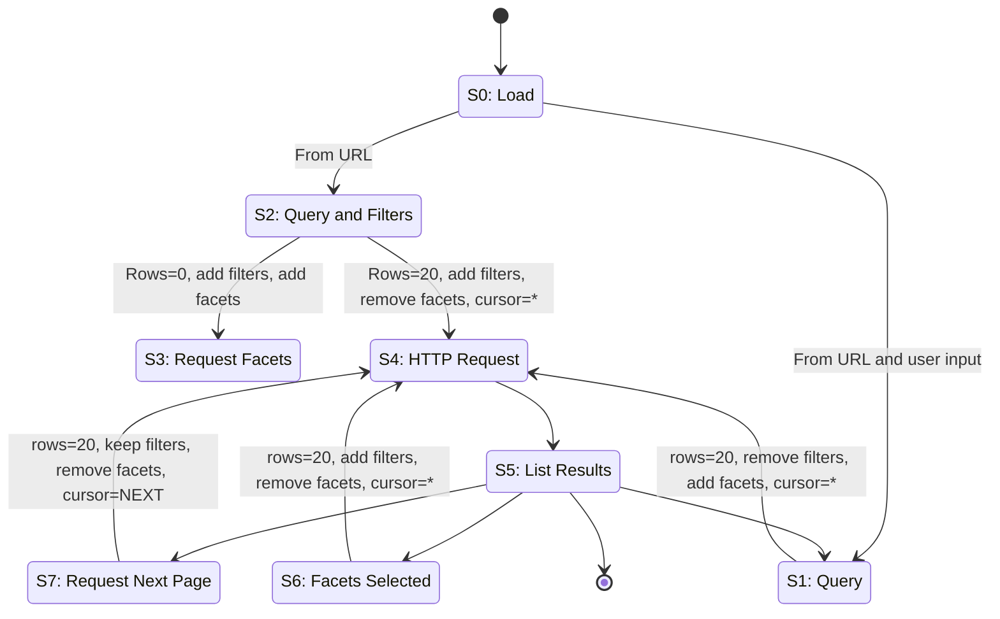

# Vue Starter

Vue 3 + TypeScript + Vite starter.

## Setup

```bash
npm install
```

## Scripts

| Command              | Description                |
| -------------------- | -------------------------- |
| `npm run dev`        | Start dev server           |
| `npm run build`      | Production build           |
| `npm run preview`    | Preview production build   |
| `npm run test`       | Run unit tests (Vitest)    |
| `npm run test:watch` | Unit tests in watch mode   |
| `npm run test:e2e`   | Run E2E tests (Playwright) |
| `npm run lint`       | Lint and fix               |

## Tech stack

- Vue 3 (Composition API, `<script setup>`)
- TypeScript
- Vite
- Vue Router
- Vitest (unit)
- Playwright (E2E)


## Design Decisions

This search website has these requirements:
1. It must fetch data when user search it or when page loads with default query parameter.
2. It must re-fetch data when user select facets/filters.
3. It must fetch more data if user request more results of a searched query.
4. Avoid fetching if it is not related to 1-3 points.

Given the requirements, the general fetching flow should follow this state-machine design:



Using this state machine the search website will:
1. Trigger a first request when user searchs or page loads with query params.
   1. If the query params has filters then a parallel request will trigger to retrieve facets only since the original request will fetch with filters.
2. If the user select facets a new request with the filters will trigger.
   1. Selecting facets has a debounced behaviour of 1.3s to allow user selecting multiple values before triggering the request.
3. If user scrolls to the bottom of the results list then a new request will fetch more results using `cursor` paramater.

Additional features:
- Any filter or search query will be added automatically in the URL's query params. So, user can reload the window or share the search URL.
- Facets are able to set multiple filters. For instance, `published` facet adds `from-pub-date` and `until-pub-date` filters combined.

Technical stuff and developer comments:
- Almost all features are built in top of `@vueuse` utilities like `useFetch`, `useStorage` and much more.
- I used tailwindcss and Claude Opus AI for styling stuff. Since the page is simple and UI was not important for this assignment I gave it instructions to build the layout, color palette and other things related to UI.
- I spent around 7 hours completing this assignment even though only 1-2 hours of work was required haha. But let me explain myself:
  - The fist 2 hours I basically tested the API, read the swagger docs and designed the state machine I would use as the core concept of my solution.
  - For the rest of the time It was only me coding the state-machine, coding specific utilities for this assignment, applying generic patterns for "future maintenance", fixing AI allucinations, drinking coffee and listening music :D


## Setup

```bash
npm install && npm run dev
```